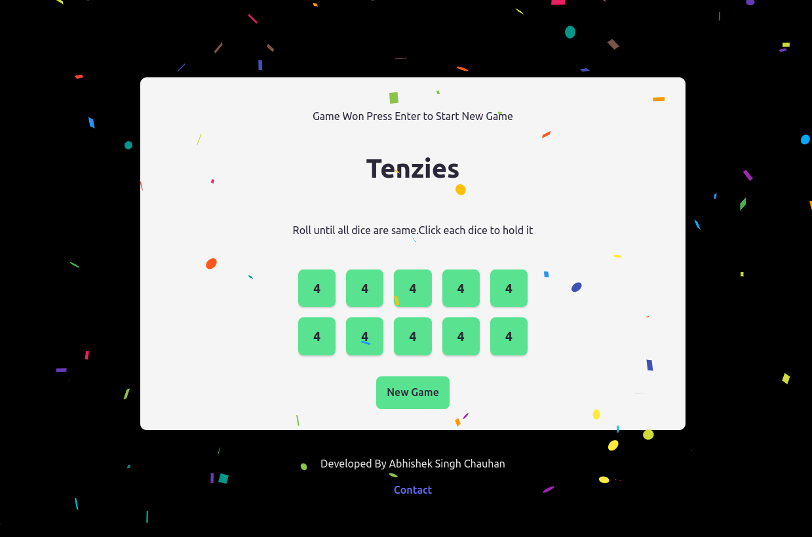

# 🎲 Tenzies Game

A fun and addictive dice game built with **React** and bundled using **Vite** — deployed as a static site. The game is responsive, interactive, and celebrates your win with confetti! 🎉

 

---

## 🔗 Live Demo

Play the game here:  
👉 [https://yourusername.github.io/tenzies-game](https://yourusername.github.io/tenzies-game)  
*(Replace with your actual deployment URL)*

---

## 🎮 How to Play

- Click **Roll** to roll the dice.
- Click on any die to **hold** its number.
- Keep rolling until **all dice show the same number**.
- Once you win, enjoy the **confetti celebration**!

---

## 🧩 Features

- 🎲 10 Dice with numbers between 1–6
- 🖱️ Click to hold dice between rolls
- 🔄 Roll remaining dice only
- ✅ Win detection logic
- 🎉 Confetti animation on winning
- 📱 Fully mobile-responsive layout

---

## 💡 Built With

- **React** (Frontend logic)
- **Vite** (For fast builds and bundling)
- **CSS** (Responsive custom styling)
- **Canvas-Confetti** (Win animation)

---

## 📱 Responsive Design

- 🖥️ Works on desktops, tablets, and mobile phones
- 👁️ Dice layout adapts based on screen size
- 🧩 5×2 grid on large screens, wrapping on small screens

---

## 📁 Deployment Info

This repository contains **only the static build** of the app, intended for platforms like GitHub Pages, Netlify, or Vercel.

---

## 🧑‍💻 Developer

Made with ❤️ by [Abhishek Singh Chauhan](https://github.com/Abhisheksinghchauhan192)

---

